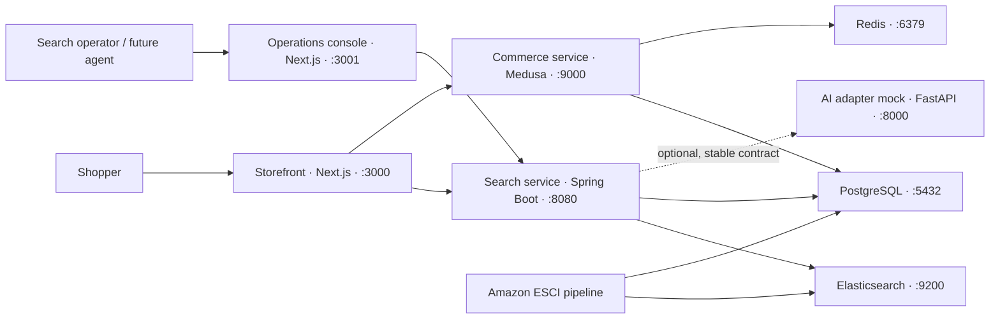

# Architecture

## System context

## Service boundaries

| Component | Owns | Must not own |
| --- | --- | --- |
| Storefront | Product discovery UI, cart UI, checkout UI and provenance labels | Search policy, direct database access |
| Operations console | Metrics, result preview, policy workflow and audit UI | Direct Elasticsearch access |
| Medusa commerce | Cart, deterministic inventory checks, simulated order creation | Search ranking and relevance labels |
| Search service | Catalog index, BM25, search logs, metrics, evaluation, policy workflow, audit and agent tools | Checkout or payment |
| AI adapter | Stable rewrite/rerank/strategy contracts and deterministic mock provider | Search-system source of truth |
| PostgreSQL | Commerce state, policy state, quality metrics and immutable audit events | Product relevance retrieval |
| Elasticsearch | Searchable ESCI catalog and query-time ranking | Policy approval state |

## Request and data flow

1. The ESCI pipeline downloads the official parquet files, validates their SHA-256 values when configured, keeps US-locale small-version judgments, and selects queries with a stable seeded hash.
2. It retains at least the strongest-labelled product for every selected query, then keeps a stable sample of further judged products and fills to the configured product limit.
3. Product text and ESCI labels are preserved. Price, stock, category, placeholder color and popularity are deterministically derived from the product ID.
4. Seed loads simulated commerce attributes into PostgreSQL and product documents into a versioned Elasticsearch index behind the `products-read` alias.
5. Storefront search reaches the Java API, which compiles the published strategy and submits the final query to Elasticsearch.
6. Each request emits structured logs and a PostgreSQL search event. Operations views aggregate those events and the most recent offline evaluation.
7. Policy drafts proceed through `DRAFT → IN_REVIEW → APPROVED → PUBLISHED`. Publishing retires the prior version. Rollback republishes a historical approved snapshot.

## Ports and probes

| Service | Port | Health | Readiness |
| --- | ---: | --- | --- |
| Storefront | 3000 | `/api/health` | `/api/health` |
| Operations console | 3001 | `/api/health` | `/api/health` |
| AI adapter | 8000 | `/ai/health` | `/ready` |
| Search service | 8080 | `/actuator/health/liveness` | `/actuator/health/readiness` |
| Medusa commerce | 9000 | `/health` | `/health` |
| Elasticsearch | 9200 | `/_cluster/health` | `/_cluster/health?wait_for_status=yellow` |
| PostgreSQL | 5432 | `pg_isready` | `pg_isready` |
| Redis | 6379 | `PING` | `PING` |

## Primary APIs

- Store: `/lab/commerce/carts`, `/lab/commerce/orders` on Medusa.
- Search: `/api/v1/search`, `/api/v1/products/{id}`, `/api/v1/search/explain`.
- Operations: `/api/v1/ops/*`, `/api/v1/strategies/*`, `/api/v1/audit`.
- Agent tools: `/api/v1/tools/*`; writes require `Idempotency-Key`, actor, request ID, and governed state transitions.
- AI: `/ai/query-rewrite`, `/ai/rerank`, `/ai/strategy-suggest`, `/ai/health`.

## Failure behaviour

- Search never requires AI. Adapter timeouts or failures are logged and the BM25 query continues unchanged. The fallback is not silent: every search response carries `ai_status` — `APPLIED` or `NO_CHANGE` when the adapter answered, and `NOT_REQUESTED` / `DISABLED` / `TIMEOUT` / `TRANSPORT_ERROR` / `INVALID_RESPONSE` otherwise — plus `ai_provider` when a provider actually answered. `ai_applied` reports whether the query text was really rewritten, not merely whether the call succeeded.
- The search service admits an adapter response on one condition only: a usable `rewritten_query`. The provider name is recorded and forwarded, never validated, so a real provider replaces the mock without any change to the storefront, console or Java contracts.
- The storefront gives actionable errors for search and commerce failures and retains a device-local cart ID.
- Index rebuild creates a new physical index and moves the read alias only after a successful refresh and document-count check.
- Policy publish and audit insertion share a database transaction; Elasticsearch is affected only at query compilation time, so no distributed commit is required.
